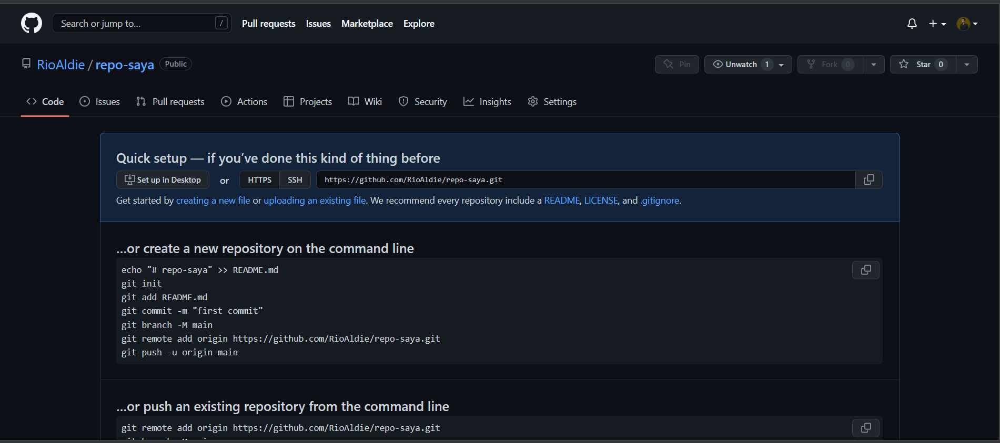
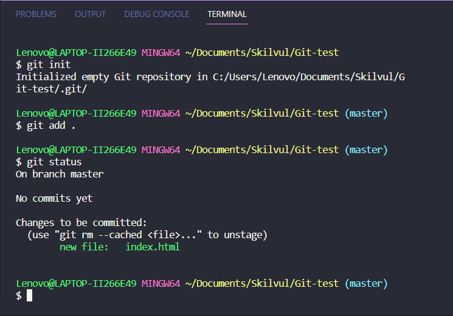
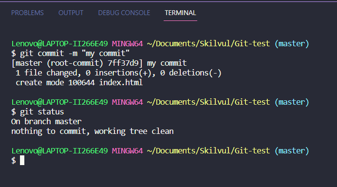
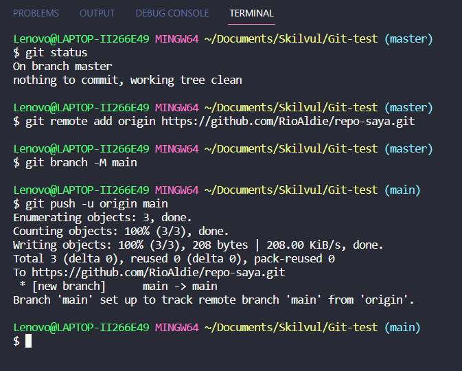
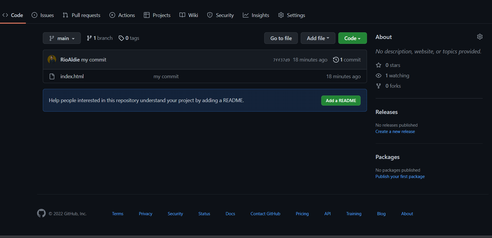
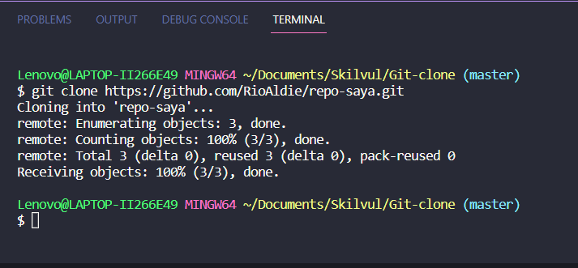

# Week And Presentation Week 1

## Unix Command Line

#### **Shell**

- Shell adalah user interface yang bertugas untuk memproses semua perintah yang diketik di CLI.
- Terdapat 2 jenis shell yaitu Command Line Interface (CLI) dan Graphical User Interface (GUI).

#### **Command Line Interface**

- Command Line Interface atau CLI adalah program yang memungkinkan pengguna mengetik perintah teks yang memerintahkan komputer untuk melakukan tugas tertentu.
- Ada Beberapa CLI Shell contoh:

  - bash
  - zsh
  - fish
  - dash

- Cara mengakses cli dikomputer untuk windows adalah menggunakan command promt, yaitu Buka menu pada ❖ atau Windows Logo 🡒 ketik “Command Prompt” 🡒 pilih Command Prompt.
- berikut adalah tampilan awal dari command-prompt, cli bawaan dari windows.
- 
- didalam CLI kita bisa melakukan berbagai perintah seperti
  -membuat file
  -menghapus file
  -menganti nama sebuah file
  -dll.

#### **Graphic User Interface**

- GUI merupakan bentuk antarmuka yang memungkinkan pengguna untuk menggunakan elemen grafis dalam berinteraksi dengan komputer atau sistem operasi.
- ini adalah tampilan GUI yang ada di Windows
- 
  didalam GUI kita juga bisa melakukan beberapa hal seperti di CLI, GUI juga memiliki kelebihannya sendiri yaitu didalam GUI kita mampu menampilkan media visual seperti Image, Poto dan Video.

#### **File System**

- Pengertian File System itu adalah suatu cara untuk memisahkan data yang ada pada disk/drive dan dibagi menjadi beberapa bagian.
- semua disk atau penyimpanan yang ada dikomputer pasti menggunakan file system tertentu.
  - windows menggunakan **NTFS(New Technology File System)**
  - Mac menggunakan **HFS+(Hierarchical File System+)**
  - Linux menggunakan file system yang berbeda-beda karena Linux memiliki banyak sistem operasi dan distro,tapi umumnya Linux menggunakan **EXT(EXTended File System)**
- **pwd**
- command pwd berfungsi untuk melihat current working directory
- untuk menggunakan pwd cukup mengetikan pwd di shell cli.
- 

#### **ls**

- command ls berfungsi untuk menampilkasn list isi di sebuah directory
- untuk menggunakan ls cukup mengetikan ls di shell cli.
- 

#### **cd**

- command cd berfungsi untuk berpindah directory
- untuk masuk kedalam sebuah directory dapat menggunakan

```
  cd namadirektori

```

- 
- untuk keluar dari directory dapat menggunakan

```
  cd ..

```

- 

#### **head,tail,cat**

- head, tail dan cat sama-sama berfungsi untuk menampilkan isi dari sebuah files, walaupun memiliki fungsi yang sama mereka memiliki kemampuan yang berbeda-beda seperti head hanya akan menampilkan bagian kepala atau atas dari sebuah file, sedangkan tail adalah kebalikan head tail akan menampilkan bagian akhir dari sebuah file, sedangkan cat berfungsi untuk menampilkan seluruh isi dari file karena itulah cat jauh lebih sering digunakan.
- contoh penggunaan cat
- 

#### **mkdir**

- command mkdir berfungsi untuk membuat atau menambah sebuah direktori atau folder baru
- cara penggunaan mkdir

```
- mkdir (spasi) nama direktori

```

- 

#### **Touch**

- Touch berfungsi membuat file baru dapat menggunakan Touch
- cara menggunakan touch

```
- touch (spasi) nama file yang akan dibuat

```

- 

#### **cp**

- cp adalah command untuk menyalin atau mencopy direktori dan file
- cara menyalin direktori menggunakan cp adalah mengetikan cp -r (nama direktori yang akan dicopy) (nama direktori baru)

```
- cp -r direktori_baru direktori_copian

```

- - 

- cara menyalin file menggunakan cp adalah mengetikan cp (nama file yang akan dicopy) (nama file baru)

```
- cp file_baru file_copian

```

- 

#### **mv**

- command mv berfungsi untuk memindahkan atau rename file dan direktori
- cara penggunaan mv sebagai berikut

  - untuk memindahkan file caranya adalah mengetikan mv (nama file yang akan dipindahkan) (direktori yang dituju)

  ```
    mv file.html direktori/

  ```

  - hasil 
  - untuk memindahkan direktori caranya adalah mengetikan mv (nama direktori yang akan dipindahkan) (direktori yang dituju)

  ```
    mv directori_satu/ direktori_dua/

  ```

  - hasil 
  - untuk menganti nama file/direktori adalah mengetikan mv (nama file sebelumnya) (nama file baru)

  ```
    mv nama_lama nama_baru

  ```

  - hasil 

#### **rm**

- command rm berfungsi untuk menghapus direktori dan file
- untuk menghapus file/direktori cukup menuliskan rm (nama file yang akan dihapus)
- hasil 

## Git dan Github Dasar

<!-- Peserta mampu memahami kenapa Git dan Github tools yang wajib digunakan -->

#### **Git**

- Git adalah sebuah version control system pada perangkat lunak yang berfungsi untuk menyimpan setiap perubahan pada file maupun direktori pada suatu project.
- kenapa kita harus menggunakan Git pada project kita, karena dengan git kita bisa mengetahui perubahan apa saja yang terjadi.

#### **Github**

- Github adalah sebuah website untuk manajemen project entah itu menyimpan maupun megelola, github juga merupakan platform jejaring sosial bagi software developer diseluruh dunia.
- kenapa kita harus menggunakan Github, karena Github memudahkan kita untuk menyimpan kode yang telah kita buat dan Github juga membantu kita untuk berkolaborasi dengan orang lain, Github juga bisa kita gunakan sebagai portfolio kita.
  <!-- Peserta mampu memahami perbedaan antara Git dan Github -->
  <!-- Peserta mampu memahami alur kerja dari Git dan Github -->

#### **Alur Kerja**

- Alur kerja untuk penggunaan Git dan Github adalah
  1. buat sebuah repositori baru diwebsite github
  2. buka file project kita diterminal
  3. lakukan inisiasi dengan git init
  4. buat remote baru
  5. masukan file dengan git add ./ git \* (setalah melakukan git add . file perubahan akan tersimpan di lokal kita)
  6. lakukan commit pada file yang telah ditambahkan dengan git commit (setelah melakukan commit perubahan akan tersimpan secara permanen dilokal)
  7. lakukan push untuk mengirim file kedalam repositori kita (setelah push dilakukan file kita akan otomatis tersimpan di github secara permanen)
  <!-- Peserta mampu memahami dan membuat Repository Git -->

#### **Repositori**

- Repositori adalah sebuah direktori untuk menyimpan files didalam github, repositori biasanya disebut repo.
- cara membuat repo adalah
- .masuk kedalam platform github
- .klik tombol new repositori
- .masukan nama repositori dan pilih public atau private
- .untuk pengaturan lainnya adalah opsional
- .setelah itu tekan tombol create repository
- jika berhasil kita akan diarahkan ke halaman repositori dengan tampilan seperti ini
  
- kenapa muncul tampilan seperti itu, karena repositori tersebut masih kosong
<!-- Peserta mampu melakukan commit pada Git -->

#### **Add dan Commit**

- git Add berfungsi untuk menambahkan file atau perubahan file kita kedalam repositori.
- git Commit berfungsi untuk menyimpan file yang ditambahkan kedalam local.
- cara melakukan add adalah dengan mengetikan git add (nama file) dan git add ./\* (untuk seluruh file)

- 

- (**_note_** add hanya dapat dilakukan setelah diinisiasi)

- cara melakukan commit adalah dengan mengetikan git commit -m "pesan atau catatan kita"



- (**_note_** commit hanya dapat dilakukan setelah file ditambahkan)
  <!-- Peserta mampu mempublish aplikasi ke Github -->
- #### **publish to Github**
- 1. untuk mempublish ke github kita perlu membuat sebuah repo
- 2. setelah itu kita inisiasi dan membuat remote baru dengan alamat yang sesuai dengan repo

  ```
  git remote add origin https://github.com/RioAldie/repo-saya.git

  ```

- 3. lalu kita buat branch baru, jika mengikuti default github nama branch kita akan menjadi main

  ```
  git branch -M main

  ```

- 4. setelah itu kita push semua file yang telah dicommit sebelumnya

  ```

  git push -u origin main

  ```

- contoh 
- hasil 
  <!-- Peserta mampu melakukan cloning Github ke local -->
- #### **Clone**
- untuk mengcloning sebuah repositori ke dalam local dapat menggunakan git clone
- 1. buat folder baru
- 2. masuk ke terminal sesuai dengan root folder
- 3. ketikan git clone (link dari repo yang akan diclone)
- 4. cloning berhasil
- contoh 

## HTML

- **HTML(hyper text markup language)** adalah sebuah bahasa markup yang berfungsi sebagai kerangka dasar dalam pembuatan website.
- file html memiliki format namafile.html
- susunan html bisa dibuat dengan hanya element html,head,title,body tetapi setelah hadirnya html 5 susunannya berubah.
- contoh syntak html

```
  <html>
    <head>
      <title> website dengan HTML</title>
    </head>
    <body>
      Halaman Utama
    </body>
  </html>

```

- contoh syntax html5

```
<!DOCTYPE html>
<html lang="en">
<head>
    <meta charset="UTF-8">
    <meta http-equiv="X-UA-Compatible" content="IE=edge">
    <meta name="viewport" content="width=device-width, initial-scale=1.0">
    <title>Website dengan HTML 5</title>
</head>
<body>
    Halaman Utama
</body>
</html>

```

- jika kita menggunakan text editor vscode dan sublime terdapat snippet yang membantu kita menuliskan syntax awal html yaitu cukup ketikan **!** pada file html kita
- syntax didalam html terdiri dari susunan taq atau emement
- penulisan element atau tag umumnya adalah menggunakan <> sebagai pembuka dan </> sebagai penutup, walaupun juga terdapat beberapa element yang tidak memerlukan penutup element itu disebut void element.
- contoh tag HTML yang paling sering digunakan

  ##### Tag untuk memanipulasi Font/text

  - **h1,h2,h3,h4,h5,h6** adalah element yang digunakan untuk membuat judul didalam html, element ini dimulai dari h1 untuk ukuran terbesar dan diahiri h6 untuk ukuran judul terkecil
  - ```
      <h1>Header 1</h1>
      <h2>Header 2</h2>
      <h3>Header 3</h3>
      <h4>Header 4</h4>
      <h5>Header 5</h5>
      <h6>Header 6</h6>

    ```

  - **p** adalah element tag yang digunakan untuk membuat sebuah paragraf dalam html
  - ```
      <p>Lorem ipsum dolor sit amet consectetur adipisicing elit. Soluta excepturi magni perferendis, totam neque corporis suscipit expedita. Libero, rerum? Ut cum officia architecto deserunt corporis amet mollitia fugit molestias exercitationem.</p>

    ```

  - **b,i,bold,strong,q** adalah tag untuk merubah styling font/text.
  - ```
     <b>Untuk merubah text menjadi bold/bercetak tebal</b>
     <bold>Untuk merubah text menjadi bold/bercetak tebal</bold>
     <strong>Untuk merubah text menjadi bold/bercetak tebal</strong>
     <i>untuk merubah text menjadi italic/bercetak miring</i>
     <q>untuk menambahkan " " / tanda kutip atau merubah text menjadi quotes </q>

    ```

  ##### List dan Tabel

  - **ul,ol dan li** adalah taq untuk membuat list di html
  - li sebagai penampung data yang ada dilist atau sebagai item yang dilist
  - ul untuk membuat unordered list atau list yang tidak teratur
  - ol untuk membuat ordered list atau list yang teratur/berurutan
  - ```
    <ul>
      <li> list item 1 </li>
      <li> list item 2 </li>
      <li> list item 3 </li>
    </ul>
    <ol>
      <li> list item 1 </li>
      <li> list item 2 </li>
      <li> list item 3 </li>
    </ol>

    ```

  - **table,th,tr,td** adalah element tag html untuk membuat sebuah tabel
  - table untuk membuat sebuah table itu sendiri
  - th untuk membuat tabel head
  - tr untuk membuat tabel row
  - td untuk membuat tabel cell

  ```
  <table border="solid">
      <tr>
          <th>name</th>
          <th>umur</th>
          <th>kota</th>
      </tr>

      <tr>
          <td>rio</td>
          <td>21</td>
          <td>nganjuk</td>
      </tr>
  </table>
  ```

  ##### Anchor

  - **a href** adalah tag element html yang berfungsi sebagai penampung link aktif dan sebagai navigasi

  ```
      <a href="#home"> tombol untuk pergi ke home </a> //contoh penggunaan a href untuk navigasi dihalaman dengan menggunakan id sebagai targetnya
      <a href="https://facebook.com"> tombol untuk pergi ke website lain </a> //contoh penggunaan a href untuk membuka website lain
  ```

  ##### Section,Div,Span

  - **Section** adalah tag html untuk mendefinisikan setiap sesi
  - **Div** adalah tag html untuk mendefinisikan divisi, element div sendiri sangat erat dengan konsep Box element
  - **Span** adalah tag yang sebenarnya tidak mempresentasikan apapun, span sering digunakan untuk memanipulasi text pada bagian tertentu span berkaitan erat dengan styling.

  ```
    <section>
      <div>
        ini adalah sebuah div didalam section <span> ini span </span>
      </div>
    </section>

  ```

  ##### Media atau Content

  - **img** adalah tag untuk menampilkan sebuah gambar
  - **audio** adalah tag untuk menampilkan suara
  - **video** adalah tag untuk menampilkan video

  ##### Semantic element

  - **semantic html** adalah tag html yang lebih mementingkan informasi yang ada, semantic html juga sangat berguna untuk menunjang peforma SEO.
  - **article** untuk membuat elemen artikel
  - **aside** untuk membuat elemen bagian samping
  - **details** untuk membuat elemen datail atau spoiler
  - **figcaption** untuk membuat teks caption pada figure
  - **figure** untuk membuat figur atau gambar pada artikel
  - **footer** untuk membuat footer
  - contoh implementasi semantic

```<!DOCTYPE html>
<html lang="en">
<head>
    <meta charset="UTF-8">
    <meta http-equiv="X-UA-Compatible" content="IE=edge">
    <meta name="viewport" content="width=device-width, initial-scale=1.0">
    <title>Semantic HTML</title>
</head>
<body>
    <header>
        <nav>
            navigasi
        </nav>
    </header>
    <article>Artikel 1
        <figure>gambar</figure>
    </article>
    <article>Artikel 2</article>
    <aside>Aside </aside>
    <footer>
        footer
    </footer>
</body>
</html>
```

## CSS
