# Week And Presentation Week 1

## Unix Command Line

### Shell

- **Shell**
- Shell adalah user interface yang bertugas untuk memproses semua perintah yang diketik di CLI.
- Terdapat 2 jenis shell yaitu Command Line Interface (CLI) dan Graphical User Interface (GUI).
- **Command Line Interface**
- Command Line Interface atau CLI adalah program yang memungkinkan pengguna mengetik perintah teks yang memerintahkan komputer untuk melakukan tugas tertentu.
- Ada Beberapa CLI Shell contoh:

  - bash
  - zsh
  - fish
  - dash

- Cara mengakses cli dikomputer untuk windows adalah menggunakan command promt, yaitu Buka menu pada ❖ atau Windows Logo 🡒 ketik “Command Prompt” 🡒 pilih Command Prompt.
- berikut adalah tampilan awal dari command-prompt, cli bawaan dari windows.
- 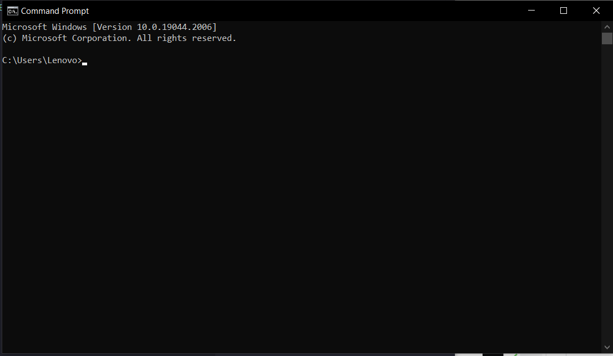
- didalam CLI kita bisa melakukan berbagai perintah seperti
  -membuat file
  -menghapus file
  -menganti nama sebuah file
  -dll.
- **Graphic User Interface**
- GUI merupakan bentuk antarmuka yang memungkinkan pengguna untuk menggunakan elemen grafis dalam berinteraksi dengan komputer atau sistem operasi.
- ini adalah tampilan GUI yang ada di Windows
- 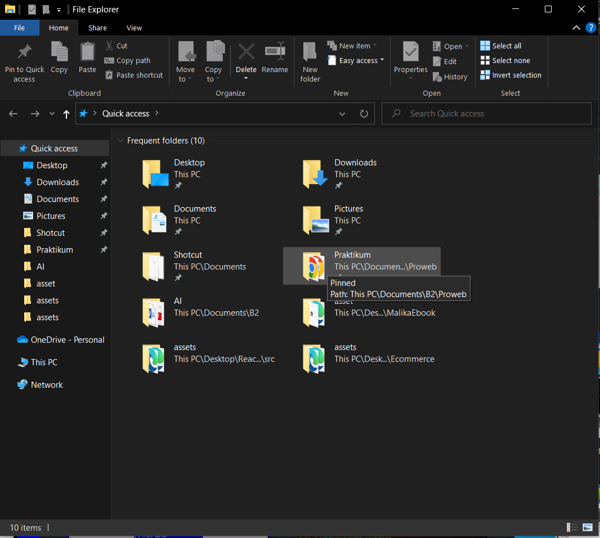
  didalam GUI kita juga bisa melakukan beberapa hal seperti di CLI, GUI juga memiliki kelebihannya sendiri yaitu didalam GUI kita mampu menampilkan media visual seperti Image, Poto dan Video.
- **File System**
- Pengertian File System itu adalah suatu cara untuk memisahkan data yang ada pada disk/drive dan dibagi menjadi beberapa bagian.
- semua disk atau penyimpanan yang ada dikomputer pasti menggunakan file system tertentu.
  - windows menggunakan **NTFS(New Technology File System)**
  - Mac menggunakan **HFS+(Hierarchical File System+)**
  - Linux menggunakan file system yang berbeda-beda karena Linux memiliki banyak sistem operasi dan distro,tapi umumnya Linux menggunakan **EXT(EXTended File System)**
- **pwd**
- command pwd berfungsi untuk melihat current working directory
- untuk menggunakan pwd cukup mengetikan pwd di shell cli.
- 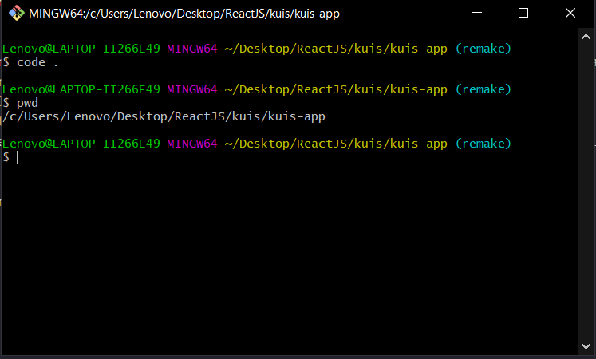
- **ls**
- command ls berfungsi untuk menampilkasn list isi di sebuah directory
- untuk menggunakan ls cukup mengetikan ls di shell cli.
- 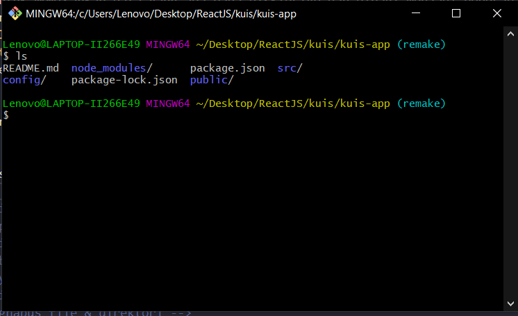
- **cd**
- command cd berfungsi untuk berpindah directory
- untuk masuk kedalam sebuah directory dapat menggunakan

```
  cd namadirektori

```

- 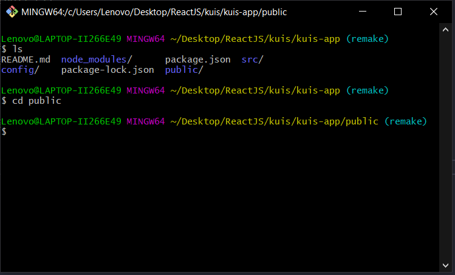
- untuk keluar dari directory dapat menggunakan

```
  cd ..

```

- 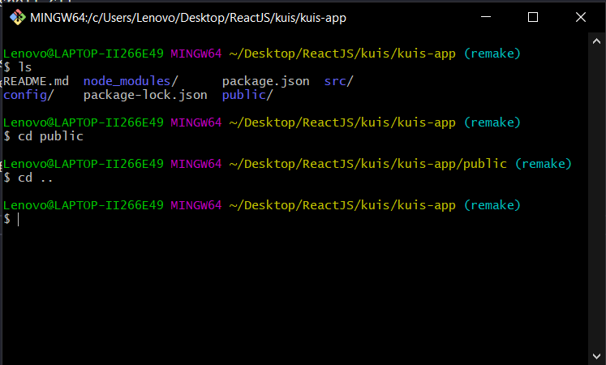
- **head,tail,cat**
- head, tail dan cat sama-sama berfungsi untuk menampilkan isi dari sebuah files, walaupun memiliki fungsi yang sama mereka memiliki kemampuan yang berbeda-beda seperti head hanya akan menampilkan bagian kepala atau atas dari sebuah file, sedangkan tail adalah kebalikan head tail akan menampilkan bagian akhir dari sebuah file, sedangkan cat berfungsi untuk menampilkan seluruh isi dari file karena itulah cat jauh lebih sering digunakan.
- contoh penggunaan cat
- 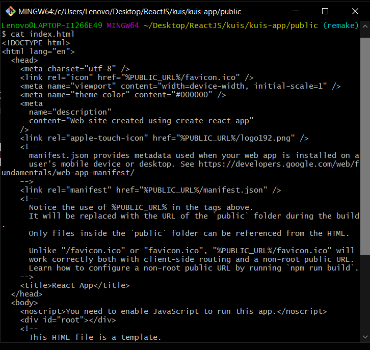

- **mkdir**
- command mkdir berfungsi untuk membuat atau menambah sebuah direktori atau folder baru
- cara penggunaan mkdir

```
- mkdir (spasi) nama direktori

```

- 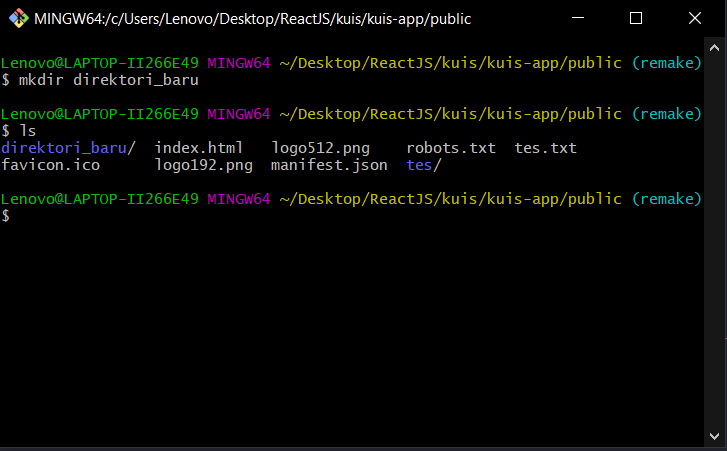

- **Touch**
- Touch berfungsi membuat file baru dapat menggunakan Touch
- cara menggunakan touch

```
- touch (spasi) nama file yang akan dibuat

```

- 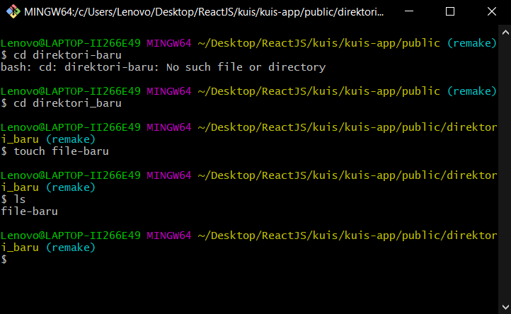

- **cp**
- cp adalah command untuk menyalin atau mencopy direktori dan file
- cara menyalin direktori menggunakan cp adalah mengetikan cp -r (nama direktori yang akan dicopy) (nama direktori baru)

```
- cp -r direktori_baru direktori_copian

```

- - 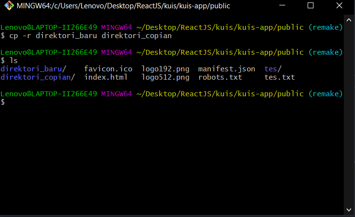

- cara menyalin file menggunakan cp adalah mengetikan cp (nama file yang akan dicopy) (nama file baru)

```
- cp file_baru file_copian

```

- 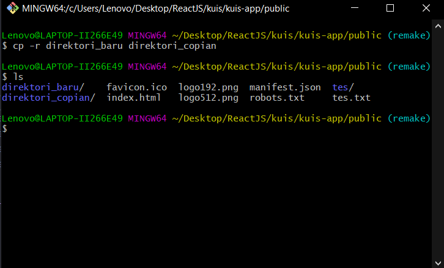

- **mv**
- command mv berfungsi untuk memindahkan atau rename file dan direktori
- cara penggunaan mv sebagai berikut

  - untuk memindahkan file caranya adalah mengetikan mv (nama file yang akan dipindahkan) (direktori yang dituju)

  ```
    mv file.html direktori/

  ```

  - hasil 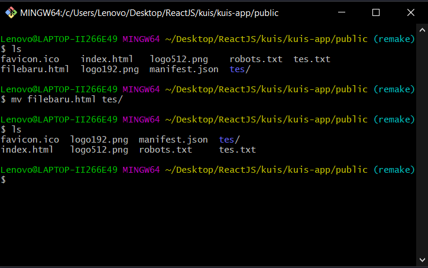
  - untuk memindahkan direktori caranya adalah mengetikan mv (nama direktori yang akan dipindahkan) (direktori yang dituju)

  ```
    mv directori_satu/ direktori_dua/

  ```

  - hasil 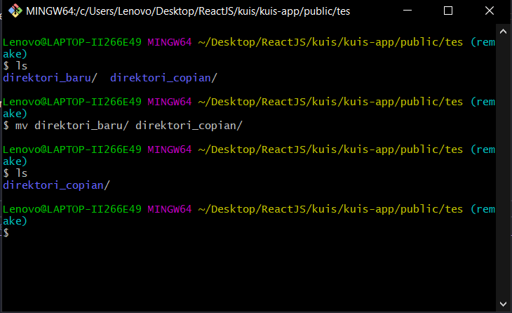
  - untuk menganti nama file/direktori adalah mengetikan mv (nama file sebelumnya) (nama file baru)

  ```
    mv nama_lama nama_baru

  ```

  - hasil 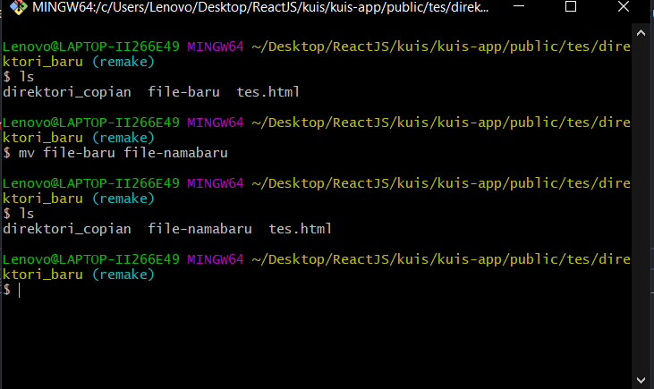

- **rm**
- command rm berfungsi untuk menghapus direktori dan file
- untuk menghapus file/direktori cukup menuliskan rm (nama file yang akan dihapus)
- hasil 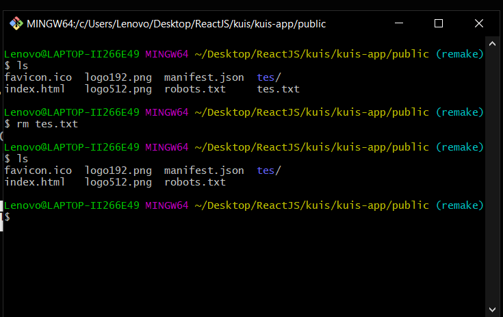

  <!-- Peserta mampu menggunakan command untuk membuat file & direktori  -->
  <!-- Peserta mampu menggunakan command untuk menyalin file & direktori  -->
  <!-- Peserta mampu menggunakan command untuk memindahkan atau me-rename file dan direktori  -->
  <!-- Peserta mampu menggunakan command untuk menghapus file & direktori -->
